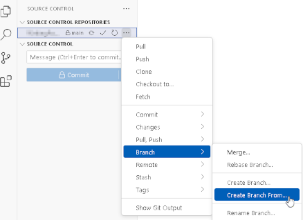
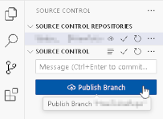

# How to Create a New Branch

## Summary

How to create a new branch locally using Visual Studio Code.

## Prerequisites

You will need Visual Studio Code installed and connected to a remote repository.

## Steps

1. Navigate to the Source Control tab from the sidebar on the left-hand side of the screen.
2. Open the additional options menu by clicking on the "..." button on the right-hand side of any listed branch name or the SOURCE CONTROL.
3. Select "Branch", and then "Create New Branch From..."
4. Pick a branch you wish to create a new one from.
5. Publish the newly created branch in the remote repository.

## Result

The new branch you created will be present in both your local and remote repositories.

## Example in pictures

**1. Create a new branch.**

**2. Publish the new branch.**

