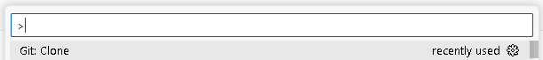
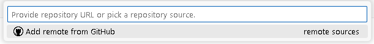
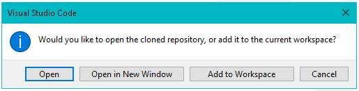

# How to Add a Repository

## Summary

How to clone your remote GitHub repository to your computer using Visual Studio Code.

## Prerequisites

1. A remote GitHub repository not cloned to your PC.

## Steps

1. On GitHub platform navigate to the repository`s dashboard.
2. Click on the "Code" button to open the drop-down menu.

3. Copy the repository url provided in the HTTPS tab.
4. In Visual Studio Code press `ctrl + shift + p` to open the command line interface.
5. Select/Write `Git: Clone`.

6. Paste the repository`s url in the specified field.

7. Select or create a directory which will be the repository destination.
8. Choose what action to take with your newly cloned repository.

## Result

You have your GitHub repository cloned to your PC, and can work and make changes locally.
