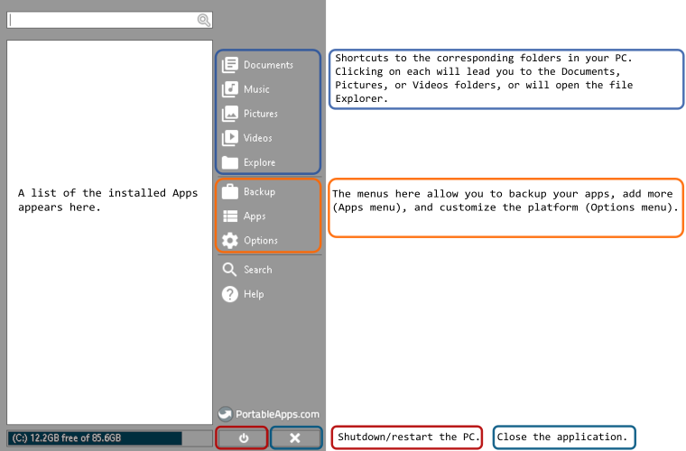
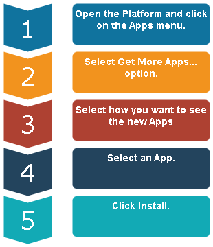

# User Guide

## About this document

* Mock guide for training purpose.
* Assumed audience of users who are familiar with various type of software, and can download and install an application without getting help.

## The application

PortableApps is an open-source, free application that provides the opportunity to use various tools without the need of installing them on your PC or laptop. All you need is a flash drive, and you can take your most favorite apps in your pocket everywhere you go.

## License

According to the official site, "Free/Open Source (GPL, some MIT, some CC images, trademarks and trade dress not included)".

>**Note**: *Some of the published applications may have different license agreements or restrictions specified on each application's page.*

## Getting started

When run for the first time, PortableApps will show a window with available apps, grouped by category. You may browse and install a desired app immediately, or click Cancel to close the window. It will be shown again when the platform is restarted.

### Menus overview

The interface is divided into two sections. On the left is a list of the installed portable applications; on the right are the menus of the platform application.

#### Platform menus

Platform menus are virtually grouped in sections according to their function.

| Menu | Description |
| -------------- | -------------- |
| Upper section | Shortcuts to folders of your PC. Clicking on each will lead you to the folder with corresponding name. |
| Middle section | Here is where you can backup your platform, add more apps to it, or customize it. Clicking on each menu folder opens a dropdown menu with different options.|
| Lower section | Help and Search. |

#### Application handling

Hovering over an added application name and right-click opens the context menu with options to run, uninstall, or perform other actions related to that app.

## How to Add an App

Steps to add an application to Portable Apps Platform.

1. Open the Platform and click on the **Apps** menu.
2. Select **Get More Apps...** option.
3. Select how you want to see the new Apps - By Category, By Title, New Releases, or Recently Updated.
4. Select an App and click Install.

If you successfully install an application, it appears on the left-hand side of the Platform's interface.

**Example:** To install *Notepad++* navigate to **Get More Apps...**; select **By Title**; scroll down and find the application; select it and install it.

## How to Remove an App

Steps to remove an installed application from the PortableApps platform.

1. Open the Platform.
2. On the left-hand side, find the application you want to remove.
3. Hover over the application.
4. Right-click and select Uninstall.
5. A warning window will appear, asking for confirmation.
6. Confirm the choice of uninstalling the application.

If application is successfully removed, it will disappear from the list of applications.

**Example:** To uninstall *Notepad++* hover over the application name; right-click on the application name; select Uninstall from the context menu.
